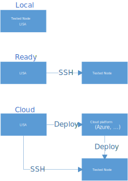

Introduction
============

**LISA** can be used to run test against the local node, or a remote node;
if it is used to run against a remote node, you don’t need to configure
anything on the remote node.

Why LISA
--------

-  **Scalable**：Benefit from the appropriate abstractions, **LISA**
   can be used to test the quality of numerous Linux distributions
   without duplication of code implementation.

-  **Customizable**: The test suites created on top of **LISA** can be
   customized to support different quality validation needs.

-  **Support multiple platforms**: **LISA** is created with modular
   design, to support various of Linux platforms including Microsoft
   Azure, Windows HyperV, Linux bare metal, and other cloud based
   platforms.

-  **End-to-end**: **LISA** supports platform specific orchestrator to
   create and delete test environment automatically; it also provides
   flexibility to preserve environment for troubleshooting if test
   failed.

Prerequisites
-------------

**LISA** can be launched on a Windows or a Linux OS. It needs to be
installed on a computer which has network access to the platform and the
node to be tested.

-  It is recommended that this computer at least has 2 CPU cores and 4GB
   memory.

Installation
------------

Follow the installation guide below to install **LISA** on your OS.

-  `Installation on Linux <installation_linux.html>`__
-  `Installation on Windows <installation_windows.html>`__

Run tests
---------

Follow `Getting started with Azure <run_test/quick_run.html>`__ to
quickly run your first test. See `Run LISA <run_test/run.html>`__ for
more detailed information.

Write tests
-----------

See `Info for developers <write_test/write.html>`__ for more detailed
information.

FAQ and Troubleshooting
-----------------------

If there is any problem, please refer to the `FAQ and
troubleshooting <troubleshooting.html>`__.

Contribute
----------

You are very welcome to contribute. Please follow `the contribution
document <contributing.html>`__ for details.
