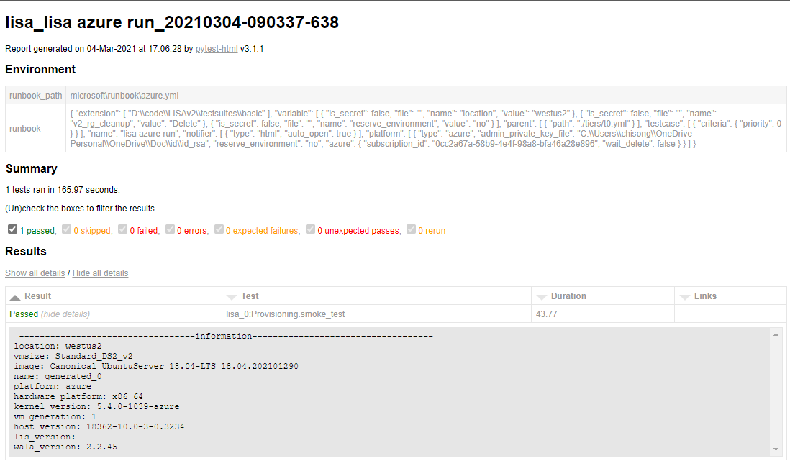

# Run LISA

- [Quick start](#quick-start)
  - [Run in Azure](#run-in-azure)
  - [Run in Ready computers](#run-in-ready-computers)
- [Run Microsoft tests](#run-microsoft-tests)
- [Run legacy LISAv2 test cases](#run-legacy-lisav2-test-cases)

## Quick start

`lisa.sh` (for Linux) and `lisa.cmd` (for Windows) are provided to wrap `Poetry`
for you to run LISA test.

In Linux, you could create an alias for this simple script. For example, add
below line to add to `.bashrc`:

```bash
alias lisa="./lisa.sh"
```

If no argument specified, LISA will run some sample test cases with the default
runbook (`examples/runbook/hello_world.yml`) on your local computer. You can use
this way to verify your local LISA environment setup. This test will not modify
your computer.

```bash
lisa
```

If you see any error from this run, please check [FAQ and troubleshooting](troubleshooting.md).

### Run in Azure

Please follow below steps to configure your local computer to run LISA test
against Linux VM on Azure.

1. Sign in to Azure

    Make sure [Azure
    CLI](https://docs.microsoft.com/en-us/cli/azure/install-azure-cli) or [Azure
    PowerShell](https://docs.microsoft.com/en-us/powershell/azure/install-az-ps)
    has been installed on your local computer. Then, please login to your Azure
    subscription to authenticate your current session. LISA also supports other
    Azure authentications, refer to [runbook reference](runbook.md).

    Here, let's choose `Azure CLI` for the setup. You should see a page pop up and all your Azure subscriptions.

    ```bash
    az login
    ```

2. Get the subscription id

    LISA needs to know the Azure subscription ID for your testing. Run below
    command to retrieve subscription information.

    ```bash
    az account show --subscription "<your subscription Name>"
    ```

    Please keep the `<subscription id>` from the output for next use.

    ```json
    {
        "environmentName": "AzureCloud",
        "homeTenantId": "<tenant id>",
        "id": "<subscription id>",
        "isDefault": true,
        "managedByTenants": [],
        "name": "<subscription name>",
        "state": "Enabled",
        "tenantId": "<tenant id>",
        "user": {
            "name": "<user account>",
            "type": "user"
        }
    }
    ```

3. Prepare SSH key pair

    LISA connects to the Azure test VM by SSH with key authentication; please
    have your key pair (public key and private key) ready before running the
    test. If you don't have a key pair, run below command to create a new one.

    ```bash
    ssh-keygen
    ```

    :warning:   Don't use passphrase to protect your key. LISA doesn't support
    that.

4. Run LISA

    Use above `<subscription id>` and `<private key file>` to run LISA. It might
    take several minutes to complete.

    ```bash
    lisa -r ./microsoft/runbook/azure.yml -v subscription_id:<subscription id> -v "admin_private_key_file:<private key file>"
    ```

5. Verify test result

    After test completed, you can refer the LISA console log, or the html report
    file for the test results. See an example html report as below:

    

    Please learn more from [runbook reference](runbook.md) for how to specify
    more parameters to customize your test.

### Run in Ready computers

If you have prepared a Linux computer for testing, please run LISA with `ready`
runbook:

1. Get the IP address of your computer for testing.

2. Get the SSH public/private key pair which can access this computer.

3. Run LISA with below parameters:

    ```bash
    lisa -r ./microsoft/runbook/ready.yml -v public_address:<public address> -v "user_name:<user name>" -v "admin_private_key_file:<private key file>"
    ```

`ready` runbook also supports tests which require multiple computers (for
example, networking testing); and, it supports password authentication too.
Learn more from [runbook reference](runbook.md).

## Run Microsoft tests

LISA comes with a set of test suites to verify Linux distro/kernel quality on
Microsoft's platforms (including Azure, and HyperV). The test cases in those
test suites are organized with multiple test `Tiers` (`T0`, `T1`, `T2`, `T3`,
`T4`). Please refer [Microsoft tests](microsoft_tests.md) to know more about the
test tier definition.

You can specify the test cases by the test tier, with `-v tier:<tier id>`:

```bash
lisa -r ./microsoft/runbook/azure.yml -v subscription_id:<subscription id> -v "admin_private_key_file:<private key file>" -v tier:<tier id>
```

:construction:  Currently we are migrating previous LISAv2 test cases to this
LISA (v3) framework. Before we complete the test case migration, only T0 test
cases can be launched on LISA (v3). Other test cases can be executed in LISA
(v3) with "Compatibility mode", which will invoke a shim layer to call LISAv2;
so you need to run LISA on a Windows computer with providing the secret file.
Learn more from [how to run legacy test cases](run_legacy.md).

For a comprehensive introduction to LISA supported test parameters and runbook
schema, please read [command-line arguments](command_line.md) and [runbook
reference](runbook.md).

## Run legacy LISAv2 test cases

Learn more from [how to run legacy LISAv2 tests](run_legacy.md).
